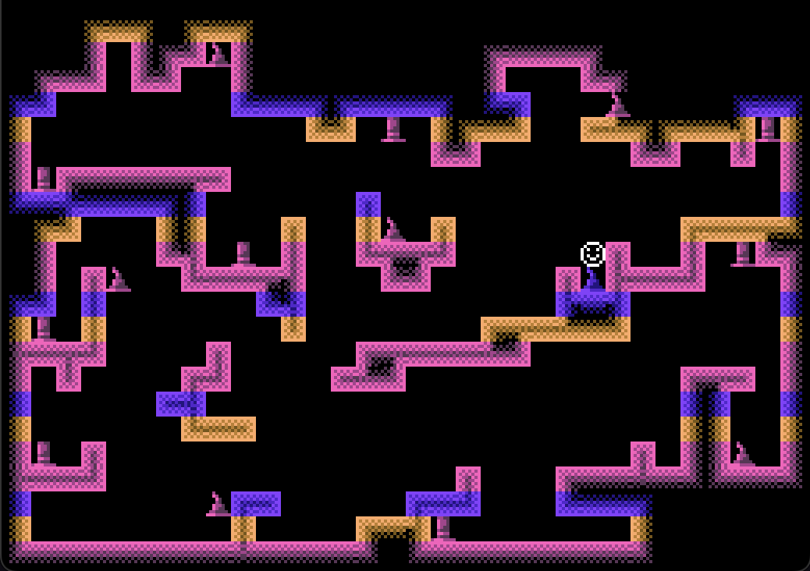
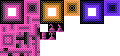

# Game 1: Hat Collector

Author: Sasha Mishkin

Design: When the player stands next to a hat, the hat gets stuck to them and so it's harder to collect new hats. The goal is to collect as many hats as possible.

Screen Shot (I have just collected a wizard hat):

How My Asset Pipeline Works:

I drew all tiles in GIMP and exported them to a PNG file, and then repeatedly cropped it into smaller ones (the size of individual tiles). I wrote a file called `png_to_tile.cpp` that takes in a PNG image and processes it to the `bit0` and `bit1` arrays required for PPU tiles. I saved those arrays into the `loadable_assets` folder. I then wrote a wrapper around `read_chunk` in `read_assets.cpp` that turns a tile in `loadable_assets` into an actual `PPU466::Tile` so that I can call the wrapper inside `PlayMode.cpp` to assign tiles to indices.

I also hard-coded the array of palettes in `palettes.cpp` and used that array to both initialize `ppu.palettes` *and* determine which pixel in a tile png should index into which color (as part of `png_to_tile`).

The file `tilemap.cpp` is where I created a giant static array of which tile index goes where in the background, and also assigned different palettes to different rows of the background. I used pen and paper to draw a reference tilemap to guide the creation of the static array.

Below is an image containing all the tiles I drew. I didn't create separate wall tiles in separate colors and let the PPU's color palette system do that for me, but I drew some yellow and blue tiles to test out how the colors would look.

How To Play:

So, the game is minimally playable but somewhat glitchy.

You play as the smiley face blob thingy, and you love hats. You are also sticky, and can wear a hat on any side of your body. Use arrow keys to move, and if you stand *exactly* 1 tile away from a hat (in an orthogonal direction), the hat will turn blue and stick to you! Try to collect a hat on all four sides of your body to win(?).

(My original goal was to have hats also stick to other hats, so you could have big stacks of multiple hats extending out of your body, but I could not implement that in time, so you can only stick one hat to each of your sides.)

**Known Bugs:**

The collision system breaks if you press multiple arrow keys at once. Press only one arrow key at a time if you want to play fairly. Or feel free to experiment with cheating by going through walls to try to get more hats, or something.

Also, it's finicky to have to align yourself *perfectly* with a hat's position in order to get it to stick, so some hats may be difficult or impossible to collect.

This game was built with [NEST](NEST.md).

